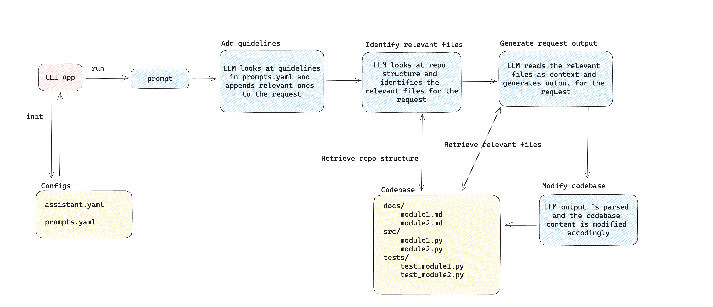

# codeas

codeas stands for CODEbase ASsistant. It boosts your software development processes by leveraging LLMs using your full codebase as context.

**Key features include**:
- ✅ **Simplicity**: easy to use and configure for your own use cases
- ✅ **Flexibility**: configure the tool your way, adapting it to your codebase and setting the tone on how you want the LLM to write code for you.
- ✅ **Reusability**: configure your prompts once and reuse them without having to rewrite them each time
- ✅ **Collaboration**: share your prompts with your colleagues and the wider community

## Why this tool ❓

There are a lot of existing AI tools for software development, each of which has its capabilities and limitations. <br>
At [Diverger](https://diverger.ai/) we decided to build our own AI tool for software development to help us where other tools can't. We chose to share it with the open-source community so that other developers can benefit from it. Any feedback and/or contribution is welcome. Happy coding!


## 🚀 Releases
⚠️ **DISCLAIMER:**
We have chosen to release this tool early, meaning the application is not fully stable. However, we are eager to get some feedback on any issues you might face or new functionalities you would like to see.

### v0.2.0 (22.11.2023)
Enables context retrieval and file creation to be more dynamic, making the tool act as an agent on your codebase.

**Release notes**
- Dynamic context retrieval: specify the files you want the LLM to use in your prompt
- Dynamic file creation: specify the files you want the LLM to create and where.
- Dynamic guideline selection: add guidelines in prompts.yaml and let the LLM decide which ones are relevant to each of your requests Cross-language support: automatic file parsing for the most popular programming languages (.ts, .js, .py, .cs, .rb, .rs, .java, .go, .c, .php)
- Multiple file context: multiple files can be used at once within the context

### v0.1.1 (03.11.2023)
Adds support for other languages by switching from [AST](https://docs.python.org/3/library/ast.html) to [Tree-Sitter](https://tree-sitter.github.io/tree-sitter/).

**Release notes**:
- Add support for javascript and java codebases.

### v0.1.0 (24.10.2023)
First release that supports simple use cases.

**Release notes**:
- Focused on simple use cases such as adding docstrings to your code, generating tests and creating markdown documentations (feel free to try more complex use cases)
- Only supports python codebases

##  🛠️ Installation

#### Pypi

```bash
pip install codeas
```

#### Development

```
git clone git@github.com:DivergerThinking/codeas.git
cd codeas
pip install -e .
```

#### OpenAI key
Currently, the tool only supports OpenAI models, but will soon be extended to other models.
To add your OpenAI key, export it as an environment variable via the terminal:

```bash
export OPENAI_API_KEY="..."
```

OR add it to a .env file at the root of your repository

## 💻 Usage

### How does it work

Before running the tool, it is important to first understand its main components and how they interact with each other.



`CLI App`: This is your entry point to the tool. We use it to initialize our config files and run the prompts we configure.

`Configs`: the application configurations are stored inside .yaml files which are generated when running `codeas init`
- `assistant.yaml`: contains the configurations for the Assistant class (see codeas.assistant.py)
- `prompts.yaml`: contains pre-written prompts and guidelines which can be run from the CLI

`Codebase`: The codebase is always the current working directory from where you run the CLI.

### Commands

If you run the tool for the first time on the repository, you must first initialize the configuration files.
Run the following command at the root of the repository you want to work with.

```bash
codeas init
```

This will generate the following config files
If you want to re-use the same configs you have from another project, you can add the `-p` or `--path` with the path to the project.

```bash
codeas init -p ../another-project/.codeas
```

#### Executing prompts from the CLI

To execute a prompt from the CLI, use ``codeas run`` followed by ``-p`` and the prompt you want to execute.

```bash
codeas run -p "generate unit tests for the assistant.Assistant class"
```

## Additional features

### Executing prompts from prompts.yaml

If you see that you are using the same prompts over and over again, you can write them to  `.codeas/prompts.yaml` and execute them by running "codeas run" followed by the prompt name you want to execute:

```yaml
# .codeas/prompts.yaml
generate_tests: Generate tests for all .py files under the /src folder.
```

```bash
codeas run generate_tests
```

### Adding guidelines to your prompts

You can add guidelines inside the ``prompts.yaml`` file which will be automatically picked up by the LLM when a request is related to it.

```yaml
# .codeas/prompts.yaml
guidelines:
  documentation: Documentation should be written in markdown format and stored under the docs/ folder.
```

When you execute a prompt related to documentation, the guideline will be automatically picked up by the LLM and appended to it

```bash
codeas run -p "generate usage documentation for evaluator.py"
```

will become 

```bash
codeas run -p "generate usage documentation for evaluator.py. Documentation should be written in markdown format and stored under the docs/ folder."
```


### Formatting generated files (auto_format)

Often more than not, LLMs output code in a format that doesn't follow your programming language conventions. We have implemented a feature to automatically format code when a file is created/modified.

Right now we have only implemented the black formatter (python): 
- configurable via the `assistant.yaml` file via `file_handler: auto_format` and `file_handler: format_command`
- by default `auto_format = False`. 
- setting `auto_format = True` and `format_command = black` every generated file will be formatted by black.

### Previewing changes

By default, any changes made to the codebase are first written to files with the suffix "_preview". This allows to easily view and accept/reject changes made to the codebase:
- configurable via the `assistant.yaml` file under `file_handler: preview`. 
- by default, it is set to True.
- setting it to False means directly overwriting the original files with the changes.

