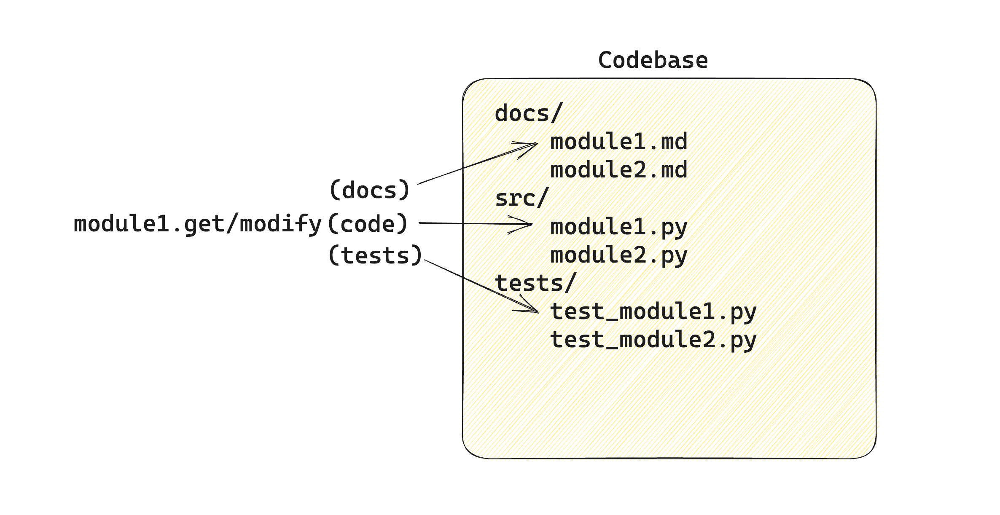
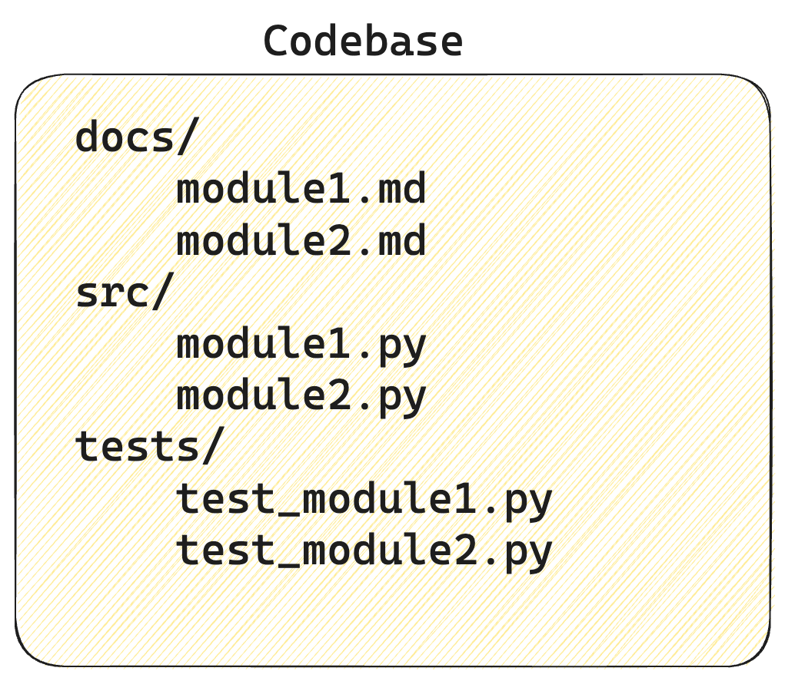

# Cobaa

Cobaa stands for COdeBAse Assistant.
It uses your codebase as context and helps you to automate the generation of code, documentation, and tests by leveraging the power of LLMs.

Key features include:
- **Flexible**: configure the tool your way, adapting it to your codebase and setting the tone on how you want code to be generated.
- **Easy to use**: execute your prompts easily from the CLI application
- **Reusable**: configure your prompts once and reuse them without having to rewrite them each time
- **Collaborative**: share your prompts with your colleagues and the wider community
- **Transparent**: track the execution flow and cost for each prompt you execute [in progress]

## Installation

#### Stable release

The tool is not yet deployed on pypi, but you can install it using ssh for now:

```bash
pip install git+ssh://git@github.com/DivergerThinking/divergen.git
```

#### Development

```
git clone git@github.com:DivergerThinking/divergen.git
cd divergen
pip install -e .
```

#### OpenAI key

Currently the tool only supports OpenAI models, but will soon be extended to other models.

To add you OpenAI key, export it as environment variable via terminal:

```bash
export OPENAI_API_KEY="..."
```

OR add it to a .env file at the root of your repository

## Usage

### How does it work

Before running the tool, it is important to first understand its main components and how they interact with each other.


`CLI App`: This is your entry point to the tool. We use it to initialize our config files and run the prompts we configure.

#### `Configs`: 
the application configurations are stored inside .yaml files generated which are generated when running `divergen init`
- `assistant.yaml`: contains the configurations for the CodebaseAssistant class (see divergen.assistant.py)
- `prompts.yaml`: contains the prompts to run through the CLI. See next point for more information.

#### `Prompt`: 
we refer to prompt as single entry inside the prompts.yaml containing the following
- `instructions`: the instructions for the LLM to perform
- `context`: the context we pass to the LLM from the module. By default this is the module's code. Options are "code", "tests" or "docs".
- `target`: the target we want to modify from the module. By default this is the module's code. Options are "code", "tests" or "docs".
- `guidelines` [optional]: some additional guidelines the LLM should follow when performing the instructions

Prompt example:
```yaml
# .divergen/prompts.yaml
generate_docs:
  instructions: Generate usage documentation in markdown format.
  context: code
  target: docs
  guidelines:
  - docs_guideline
```

#### `Modules`: 
we refer to modules as units of code stored inside a file. The particularity of our definition is that a single module can refer to three files: source code, tests and documentation files. This makes it easier for us to retrieve or modify source code, tests and documentation of a given module:



#### `Codebase`: 
we refer to a codebase as a collection of modules and their corresponding source code, test and documentation files. Even though a more comprehensive definition of a codebase should include other files such as configurations, dependency and environment files, we are not including them (yet) to simplify our application.

**IMPORTANT NOTE**: it is therefore important that our codebase is structured in such a way that documentation, tests and source code are found in three different folders.



In the above example, the ``/src`` folder contains the source_code in python files, the ``docs/`` folder the documentation files in markdown format, and the ``tests/`` folder the test files in python format. This structure is reflected in the `assistant.yaml` file 

```yaml
# .divergen/assistant.yaml
codebase:
  code_folder: ./src/
  code_format: .py
  docs_folder: ./docs/
  docs_format: .md
  tests_folder: ./tests/
  tests_format: .py
```

If your repository follows a different structure, you must adjust the ``assistant.yaml`` file accordingly.

### CLI app

**The application uses your current directory as codebase** to work with. Make sure you first `cd` to the root of the repository you want to work with.

If you run the tool for the first time on the repository, you must first inititalize the configuration files.

#### Initializing configs

Run the following command at the root of the repository you want to work with.

```bash
divergen init
```

This will generate the following config files

```
├── .divergen
│   ├── assistant.yaml
│   ├── prompts.yaml
```

If you wan to re-use the same configs you have from another project, you can add the `-p` or `--path` with the path to the project.

```bash
divergen init -p ../another-project/.divergen
```

#### Configuring prompts

Inside the `.divergen/prompts.yaml` are the prompts and their attributes.

```yaml
generate_docstrings:
    instructions: Generate docstrings using numpy style.
    target: code

generate_tests:
    instructions: Generate tests using pytest.
    target: tests

generate_docs:
    instructions: Generate usage documentation.
    target: docs
```

The above prompts are examples provided when you initialize the configs for the first time in order to get you started quickly.

#### Executing prompts

Use `divergen run` followed by the prompt name you want to execute:

```bash
divergen run generate_docstrings
```
```bash
divergen run generate_tests
```
```bash
divergen run generate_docs
```


If you don't don't want to use the yaml file, you can enter the instructions and guidelines via the CLI using the `-i` option:

```bash
divergen run -i
```

### Additional features

#### Chunking large context
[ADD INFO]

#### Formatting generated files
[ADD INFO]

#### Applying changes automatically
[ADD INFO]

## Roadmap

Future efforts will be focused on
- generalizing to other languages
- tracking execution flow and costs
- automatically retrieving modules based on instructions (currently given as input by user)
- automatically identifying context and target based on instructions (currently configured inside prompts.yaml)
