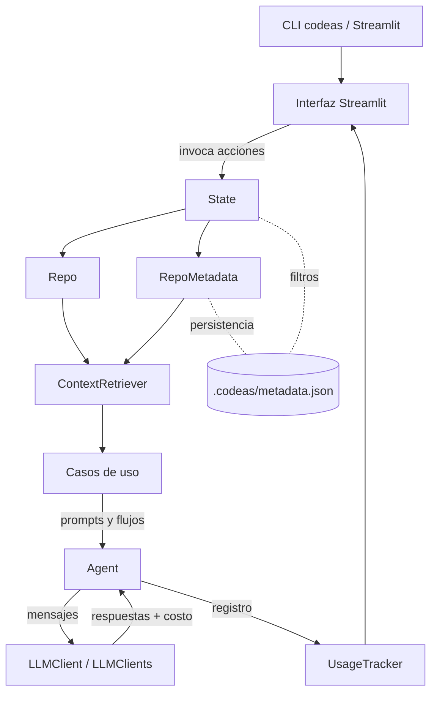

# Arquitectura de *codeas*

Este documento resume cómo está organizada la herramienta **codeas**, cuáles son los servicios y módulos principales y cómo fluyen los datos entre ellos.

## Arquitectura global

1. **Entrada y experiencia de usuario**. El ejecutable `codeas` inicia la interfaz de Streamlit definida en `src/codeas/main.py`, la cual carga la página principal `ui/🏠_Home.py`. Desde allí se navega por las páginas de documentación, despliegue, testing, refactorización, chat, gestión de prompts y uso (todas en `src/codeas/ui/pages`).
2. **Estado compartido de la sesión**. `codeas.core.state.State` centraliza la ruta del repositorio activo, la instancia del cliente LLM, los metadatos precargados y los filtros de archivos. El estado también gestiona la tabla de archivos visibles, la lectura/escritura de salidas y la persistencia de filtros en `.codeas/filters.json`.
3. **Modelo del repositorio**. `codeas.core.repo.Repo` indexa todos los archivos, calcula su costo en tokens, aplica filtros `include/exclude` y expone las rutas incluídas para los distintos casos de uso.
4. **Metadatos y enriquecimiento**. `codeas.core.metadata.RepoMetadata` coordina agentes especializados para clasificar cada archivo (`FileUsage`), generar descripciones, extraer detalles de código y de pruebas, y persistir los resultados en `.codeas/metadata.json`.
5. **Recuperación de contexto**. `codeas.core.retriever.ContextRetriever` decide qué archivos (o resúmenes) enviar al LLM según flags por dominio (UI, API, DB, etc.) y según si se requieren descripciones o detalles estructurados.
6. **Casos de uso**. Cada funcionalidad de alto nivel (documentación, despliegue, testing, refactorización) reside en `src/codeas/use_cases`. Allí se preparan contextos, prompts y modelos específicos, y se registra el costo en `UsageTracker`.
7. **Agentes y clientes LLM**. `codeas.core.agent.Agent` encapsula la construcción de mensajes, el cálculo de costos/tokens (vía `tokencost`) y la ejecución en `codeas.core.llm.LLMClient` (OpenAI) o `codeas.core.clients.LLMClients` (OpenAI/Anthropic/Gemini). Los prompts de los casos de uso se parametrizan en `src/codeas/configs/prompts.py`, mientras que los prompts de metadatos residen en `src/codeas/core/metadata.py`. Las páginas usan `configs/agents_configs.py` y `configs/llm_params.py` según corresponda.
8. **Telemetría de uso**. `codeas.core.usage_tracker.UsageTracker` persiste estadísticas de cada llamada (costos, recuentos y logs de chat) en `~/codeas/usage.json`, lo cual alimenta la página “Usage”.

## Configuración y dependencias

- **Gestión de claves y modelos**. La carga de proveedores y modelos disponibles se centraliza en `src/codeas/configs/llm_params.py`, que define los parámetros por defecto y las opciones expuestas en la UI. Las claves pueden declararse mediante variables de entorno o en la pantalla principal.
- **Prompts y plantillas**. Los prompts base se encuentran en `src/codeas/configs/prompts.py`, mientras que las configuraciones específicas por caso de uso se agrupan en `src/codeas/configs/agents_configs.py`. Esto permite ajustar temperatura, número de muestras y plantillas por dominio.
- **Dependencias de UI**. Los componentes reutilizables (tablas, paneles de filtros, selectores de modelos) residen en `src/codeas/ui/components` y consumen utilidades comunes desde `src/codeas/ui/utils.py` y `src/codeas/ui/ui_state.py`.

## Secuencia típica de ejecución

1. El usuario selecciona un repositorio en la página de inicio y decide si desea precargar metadatos existentes o generarlos desde cero.
2. `State` instancia `Repo` para descubrir archivos y calcular costes de tokens aproximados; en paralelo, se cargan los filtros previos desde `.codeas`.
3. Cuando se ejecuta un caso de uso, `ContextRetriever` utiliza los metadatos y los filtros activos para construir el contexto textual. Dependiendo de la página, se añaden opciones como “solo estructura” o “resumen detallado”.
4. El agente correspondiente construye el prompt combinando contexto, instrucciones y parámetros de modelo. La petición se envía vía `LLMClient/LLMClients`, registrando el coste estimado y real en `UsageTracker`.
5. Las salidas se muestran en la UI con controles de aceptación o descarte; si el usuario decide aplicarlas, `State` escribe los archivos o diffs seleccionados en el repositorio.

## Consideraciones de seguridad y trazabilidad

- Los filtros `include/exclude` evitan que archivos sensibles entren en el contexto. Esta selección queda reflejada en `.codeas/filters.json` para auditorías posteriores.
- `UsageTracker` registra modelo, parámetros y tamaño de contexto para cada operación, facilitando revisiones de coste y cumplimiento.
- Las rutas de salida se almacenan en `.codeas` para que los artefactos generados puedan verificarse sin reconsultar el modelo, útil en entornos con conectividad limitada.
- La UI exige confirmación antes de aplicar cambios en disco y puede ejecutarse en modo lectura (solo vista de contexto) para revisiones sin riesgo.

## Servicios y módulos clave

| Servicio / módulo | Responsabilidad principal |
| --- | --- |
| `src/codeas/main.py` | Lanza la aplicación Streamlit y enlaza la CLI con la UI. |
| `src/codeas/ui/🏠_Home.py` + `ui/pages` | Componen la experiencia visual, muestran formularios para cada caso de uso (Docs, Test, Deploy, Refactor, Chat, Prompts) y disparan acciones sobre el `state`. |
| `src/codeas/core/state.py` | Mantiene el estado compartido (repo activo, metadatos, filtros, datos para tablas) y coordina operaciones auxiliares (lectura/escritura de salidas). |
| `src/codeas/core/repo.py` | Descubre archivos, calcula tokens y aplica filtros `include/exclude` con coincidencias flexibles. |
| `src/codeas/core/metadata.py` | Define los esquemas de metadatos, orquesta agentes para poblarlos y expone helpers de lectura/exportación. |
| `src/codeas/core/retriever.py` | Construye el contexto textual a partir de archivos completos o resúmenes según flags semánticos. |
| `src/codeas/core/agent.py` | Normaliza la interacción con LLMs: construye mensajes, ejecuta completions/previas y calcula costos/tokens. |
| `src/codeas/core/llm.py` y `core/clients.py` | Proveen clientes sincrónicos/asíncronos para OpenAI (y wrappers para Anthropic/Gemini) con parámetros centralizados. |
| `src/codeas/core/usage_tracker.py` | Registra el uso por caso, los historiales de chat y las ejecuciones de generadores. |
| `src/codeas/use_cases/documentation.py` | Genera secciones de documentación combinando `ContextRetriever` con prompts por sección. |
| `src/codeas/use_cases/deployment.py` | Define estrategias y plantillas Terraform a partir del contexto del repo. |
| `src/codeas/use_cases/testing.py` | Produce estrategias de pruebas tipadas y genera archivos de test siguiendo las guías retornadas. |
| `src/codeas/use_cases/refactoring.py` | Selecciona grupos de archivos, propone cambios y genera diffs listos para aplicar. |

## Diagrama lógico

El diagrama muestra cómo la interfaz invoca acciones sobre el estado, el cual coordina el repositorio y los metadatos. Los casos de uso consumen el contexto generado y delegan la generación de contenido en agentes que, a su vez, se comunican con los clientes LLM y registran el consumo de recursos.
